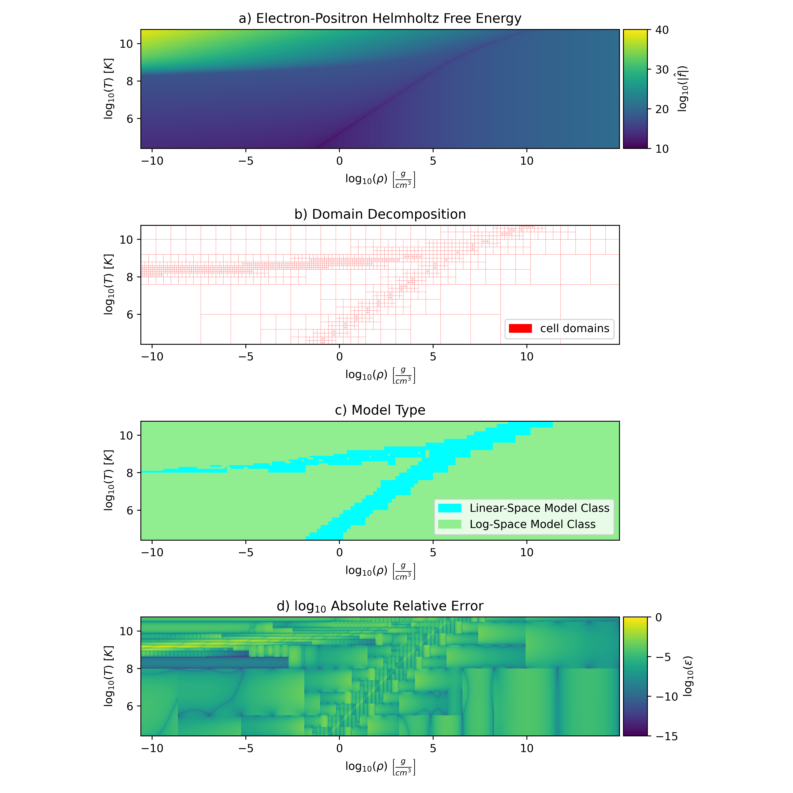

# ND-tree_tabular_data_emulator
A memory efficient emulator for tabular data, i.e. lookup tables, that utilizes an ND-tree domain decomposition. Typical lookup tables save function values at regularly spaced intervals, e.g., linearly-spaced or log-spaced. These tables are then interpolated over during runtime to return an approximation of the function for a given input. Because the point spacing is fixed over the domain this can lead to varying degrees of interpolation accuracy throughout the table's domain.

To reduce the variability of interpolation error over the domain and reduce the size of the table, we use an ND-tree decomposition of the domain. An example of this is shown in the below figure, which is taken from the paper outlining this method. The decomposition is done such that the error over the domain is as close to some desired threshold as possible, given the constraint of the input data and type of interpolation performed.



The emulator is built using the python, but there is a python and C++ version of the ND-emulator for calling a built emulator. The C++ version is build for speed and is thread safe. Furthermore, there are python and fortran bindings for the C++ version. To use them, simply build the C++ emulator into a shared library and follow the call the C extern functions in the desired application. Examples of this are outlined below.

Different types of interpolation methods are possible and will be chosen on a cell-by-cell basis based on which gives a lower expected error. Currently a nd-linear interpolation in log-space and linear-space are implemented in the python versions, and only the linear-space nd-linear interpolation is available in the c++ version.

## Initializing the repo
The emulator uses multiple submodule, which must be loaded when the repo is cloned. Load with
```
git submodule update --init --recursive --remote
```
# Using the ND-Emulator
An example of how the `build_emulator` function is called is shown in the `build_emulator.py` file. 

Required python modules:
```

```

## Building an Emulator
In order to create an emulator training data is needed. 
We store the data in a python dictionary, with the format:
```python
data = {'f': nd_data_array}
```
If other data, such as derivative information, needs to be included for a given model class, i.e. type of interpolation scheme, you can simply add it to the dictionary, e.g.,
```python
data = {'f': nd_data_array,
        'dfdx': nd_data_array}
```
To build the emulator you must also specify the maximum depth of the tree, the domain over which the data is defined, the spacing of the data (it must be regularly spaced), the desired error threshold, and the model classes you wish to use.
```python
max_depth = 5                           # There will be at most 5 refinements
domain = [[0.0, 1.0], [0.0, 2.0]]       # a 2d rectangular domain with corners at (0,1) and (0,2)
spacing = ['linear', 'log']             # points are spaced linearly in the first dim and in log-space in the second dim 
error_threshold = 1e-2                  # target interpolation error
model_classes = [{'type': 'nd-linear'}, {'type': 'nd-linear', transforms='log'}]        # The nd-linear model class done normally and after doing a log transform

```
You then build the emulator by calling
```python
from nd_emulator import build_emulator
emulator = build_emulator(data, max_depth, domain, spacing, error_threshold, model_classes)
```
### Model classes
The model class is the type of interpolation used in each cell. Currently only and ND-Linear model class is implemented. You can also specify any transformation to be done before the interpolation is done. The one transformation that is implemented is `'log'`. This transformation takes the data in a cell and shifts it so that it is all positive and then takes the log. The interpolation is then done in this so-called log-space. The results is then transformed back by undoing the log and shift operations. Because this operation is deterministic we don't store the transformed variables but the done transformation when the cell is loaded to avoid increase the memory cost.

## Saving the emulator
To save the emulator call the save method on Emulator object
```python
emulator.save(save_directory, save_file_name)
```
This will save the emulator in the save_directory directory with the name save_file_name. The emulator is saved in an HDF5 format with `"_table.hdf5"` appended to the filename given. In addition to this file a header file, named save_file_name with `"_cpp_params.h"`, is also created. This is needed for the creation of library, as each library is created for a specific table.

## Building a C++ library for the Emulator
To build the C++ library for the emulator a helper function can be used.
```python
from nd_emulator import make_cpp_emulator 
make_cpp_emulator(save_directory, emulator_name, cpp_source_dir)
```
The save_director must contain both the header file and hdf5 table created by the emulator, with no changes to their file names.
CMake is use to create the shared library so `CMAKE >= 3.10` is needed. Along with the shared library a perfect minimal hash function is created using [pthash](https://github.com/jermp/pthash). This is saved in the save directory with `"_mapping.bin"` appended to the filename. A new dataset is also created in the emulator's HDF5 file. 

The shared library that is created, name `emulator_name + ".so"`. It has "C" extern functions so that it can be called from many different languages. The ways to call it from Python, C++, and Fortran are shown in the following sections. The different function calls are as follows,
```
<emulator_name>_setup
<emulator_name>_interpolate
<emulator_name>_interpolate_single
<emulator_name>_interpolate_single_dx1
<emulator_name>_free
```
The details on how to call it vary for different language and are shown in the next section. Details on what each function does is detailed in the doc-string in [cpp_emulator/emulator/emulator_externs.cpp](cpp_emulator/emulator/emulator_externs.cpp)

## Using an Emulator
### Python
Loading an emulator in python is simple. You can either load it directly into python or load a C++ library.

```python
from nd_emulator import EmulatorCpp, load_emulator

# Loading Python emulator
emulator_py = load_emulator(save_directory + '/' + emulator_name + "_table.hdf5")

# Loading C++ emulator
 EmulatorCpp(save_directory + '/' + emulator_name + "_table.hdf5",
                               save_directory + '/' + emulator_name + "_mapping.bin",
                               emulator_name, 
                               save_directory + '/' + emulator_name + ".so")
```
Calling the emulator is then done by passing in a 2D numpy array, with each row being a different point. For example:
```python
import numpy as np

# create test data
domain = emulator_py.params.domain
low = np.array(domain)[:, 0]
high = np.array(domain)[:, 1]
N = 100
inputs = np.zeros([len(domain[:, 0]), N])
for i in range(len(domain[:, 0])):
        inputs[i, :] = np.random.uniform(low[i], high[i], size=[N])

# time the evaluation of both methods
# CPP
start_cpp = time()
out_cpp = emulator_cpp(inputs.T)
end_cpp = time()
dt_cpp = end_cpp - start_cpp
# # Python
start_py = time()
out_py = emulator_py(inputs.T)
end_py = time()
dt_py = end_py - start_py

# print speedup
print(f"cpp time: {dt_cpp} \npy  time: {dt_py} \npy/cpp : {dt_py/dt_cpp}\ndiff: L1={np.mean(diff)}, LI={np.max(diff)}")
```
The C++ version is ~10x faster than the python version.

### Fortran
To call the emulator library with in fortran you must include the emulator's header file and then use the macro for the function you wish to call. For example, if the emulator's header file is `energy_emulator_cpp_params.h` you would setup, call and free the emulator as shown below.

```fortran
! include the needed macros. Note they are undefined before be redefined.
#include "energy_emulator_cpp_params.h"

use iso_c_binding, only: c_ptr, c_null_char
implicit none

! setup the interface for the C extern functions
! -- Setup
interface
subroutine ND_TREE_EMULATOR_NAME_SETUP(table_location, mapping_location, emulator) bind(C)
        use iso_c_binding, only: c_char, c_ptr
        type(c_ptr), intent(out) :: emulator
        character(kind=c_char) :: table_location(*), mapping_location(*)
end subroutine ND_TREE_EMULATOR_NAME_SETUP
end interface
! -- Free 
interface
subroutine ND_TREE_EMULATOR_NAME_FREE(emulator) bind(C)
        use iso_c_binding, only: c_char, c_ptr
        type(c_ptr), intent(in) :: emulator
end subroutine ND_TREE_EMULATOR_NAME_FREE
end interface
! -- Interpolate Single
interface
subroutine ND_TREE_EMULATOR_NAME_INTERPOLATE_SINGLE(emulator, x,y,z, return_array) bind(C)
use iso_c_binding, only: c_char, c_ptr, c_double, c_long
        type(c_ptr) :: emulator
        real(c_double) :: x, y, z, return_array
end subroutine ND_TREE_EMULATOR_NAME_INTERPOLATE_SINGLE
end interface
! -- Interpolate single w/ derivative in second dimension
interface
subroutine ND_TREE_EMULATOR_NAME_INTERPOLATE_SINGLE_DX1(emulator, x,y,z, return_array, dy_dx1) bind(C)
        use iso_c_binding, only: c_char, c_ptr, c_double, c_long
        type(c_ptr) :: emulator
        real(c_double) :: x, y, z, return_array, dy_dx1
end subroutine ND_TREE_EMULATOR_NAME_INTERPOLATE_SINGLE_DX1
end interface

! setup file names with locations of the different components
character(*), PARAMETER :: nd_emulator_filename_energy = "./energy_emulator_table.hdf5"//c_null_char
character(*), PARAMETER :: nd_emulator_mapping_energy =  "./energy_emulator_mapping.bin"//c_null_char

! pointer to emulator
type(c_ptr) ::  nd_emulator_energy

! inputs and output vars
real(8) :: x, y, z, output
x = 1.0
y = 1.0
z = 1.0

! Setup the emulator
call ND_TREE_EMULATOR_NAME_SETUP(nd_emulator_filename_energy, nd_emulator_mapping_energy, nd_emulator_energy)

! call the emulator
call ND_TREE_EMULATOR_NAME_INTERPOLATE_SINGLE(nd_emulator_energy, x, y, z, output)

! free emulator
call ND_TREE_EMULATOR_NAME_FREE(nd_emulator_energy)

```
You can use multiple emulators, you just have to put the `#include "param_file.h"` before each call, so the macro can change to the needed name for each emulator. **Note that you need to end the fortran string with a C null terminator, `c_null_char`.**


### C++
In C++ we do not have to use the shared library and can just use the emulator directly. However, the mapping and header files are still needed. 

```C++
#include "energy_emulator_cpp_params.h"
std::string table_loc = "energy_emulator_table.hdf5";
std::string mapping_loc = "energy_emulator_mapping.bin";
auto *emulator = new Emulator<ND_TREE_EMULATOR_TYPE>(table_loc, mapping_loc);
// create 3d data for interpolation
const size_t NUM_POINTS = 10000;
const size_t NUM_DIM = 3;
double temp_min = -3.0;
double temp_max = 2.45;
double rho_min = 2.0;
double rho_max = 16;
double ye_min = 0.05;
double ye_max = 0.66;
double x0[NUM_POINTS];
double x1[NUM_POINTS];
double x2[NUM_POINTS];
double dx[NUM_DIM] = {(ye_max - ye_min)/(NUM_POINTS+10),
                        (temp_max - temp_min)/(NUM_POINTS+10),
                        (rho_max - rho_min)/(NUM_POINTS+10)};
for (unsigned int i = 0; i < NUM_POINTS; ++i) {
x0[i] = ye_min + dx[0]*(i+1);
x1[i] = temp_min + dx[1]*(i+1);
x2[i] = rho_min + dx[2]*(i+1);
}
// Create array of pointers to point to each array
double* points[NUM_DIM] = {x0, x1, x2};
// Create array for solution
double sol[NUM_POINTS] = {0};

// do interpolation on 4d data one at a time
for (int i = 0; i < NUM_POINTS; ++i) {
        double point[NUM_DIM];
        for (int j = 0; j < NUM_DIM; j++){
                point[j] = points[j][i];
        }
        emulator->interpolate(point, sol[i]);
}

// do all interpolations at once
emulator->interpolate(points, NUM_POINTS, sol);

// Free emulator
delete(emulator);
```

Using the shared library simply requires using the extern calls, as shown above in the Fortran example, only using C++ syntax. 

For more details see the doc-strings in [cpp_emulator/emulator/emulator.h](cpp_emulator/emulator/emulator.h) and [cpp_emulator/emulator/emulator_externs.cpp](cpp_emulator/emulator/emulator_externs.cpp)

# Unit Tests
There are multiple unit tests in both the python and C++ versions. The C++ tests are very basic, while the python tests are much more in depth. The python tests include building the C++ emulator and comparing its output to the python versions, as to confirm consistency between the two. 

